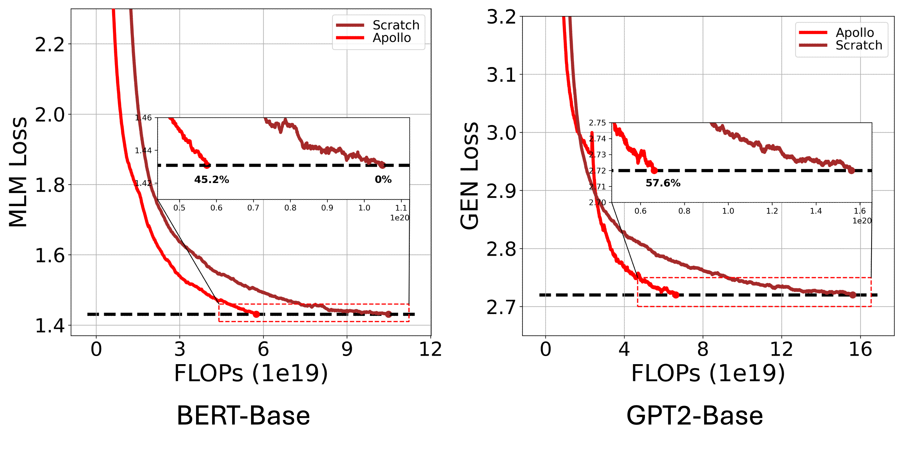

# Preparing Lessons for Progressive Training on Language Models

This repository contains the code for the AAAI-2024 oral paper [Preparing Lessons for Progressive Training on Language Models](https://arxiv.org/abs/2401.09192).

## Requirements
```
python==3.10
torch==2.2.0
transformers==4.37.1
datasets==2.16.1
accelerate==0.26.1
```
A full version of pip packages used in the testing environment can be found in `pip-list-full.txt`.

## How to run
### Prepare pretraining datasets
```bash
python download_train_datasets.py
```
### Run example training scripts for debugging
```bash
nohup bash example-scripts/run_pretrain_bert_example.sh > example-scripts/example-logs/bert-scratch-example.log 2>&1 &
nohup bash example-scripts/run_pretrain_bert_apollo_example.sh > example-scripts/example-logs/bert-apollo-example.log 2>&1 &
nohup bash example-scripts/run_pretrain_gpt_example.sh > example-scripts/example-logs/gpt2-scratch-example.log 2>&1 &
nohup bash example-scripts/run_pretrain_gpt_apollo_example.sh > example-scripts/example-logs/gpt2-apollo-example.log 2>&1 &
```
### Run full training
- Modify the scripts in `full-scripts` to fit your own hardwares for distributed training.
- Note that the training process for BERT will cost about 2 days with 32 A100-40G GPUs, and 3 days for GPT-2. Training GPT-2 on 4 * 3090 GPUs will cost more than 10 days.

## Results



Note that the pretraining datasets are not exactly the same as the ones used in the paper because of different versions of Wikipedia dataset. We used a specific version (with different preprocess procedure and cut date) of Wikipedia dataset in the paper. But finally, the acceleration results are similar.

## Citation
```
@inproceedings{pan2024apollo,
      title={Preparing Lessons for Progressive Training on Language Models}, 
      author={Yu Pan and Ye Yuan and Yichun Yin and Jiaxin Shi and Zenglin Xu and Ming Zhang and Lifeng Shang and Xin Jiang and Qun Liu},
      year={2024},
      booktitle={{AAAI}},
      publisher={{AAAI} Press},
}
```
